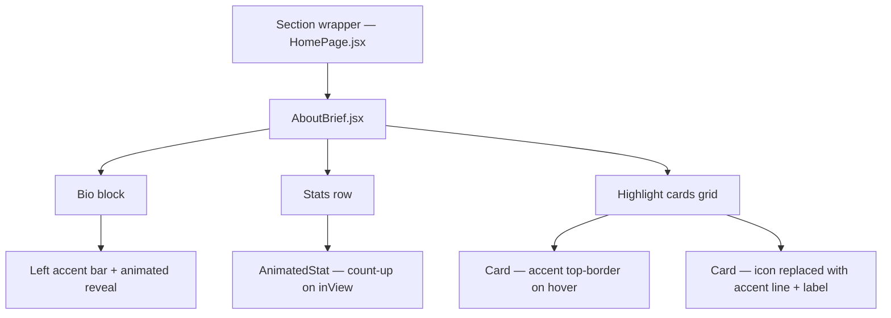
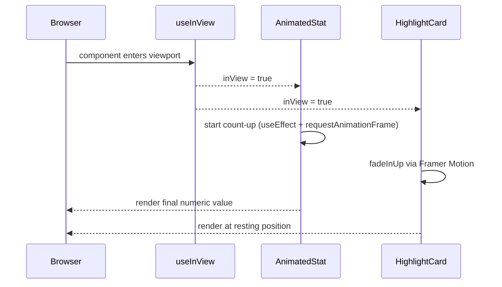

# Design Document: About Page Visual Enhancement

## Overview

Enhance the `AboutBrief` component to be more visually engaging while staying true to the site's minimalist, dark-mode-first aesthetic. The enhancement introduces an accent rule on the section header, animated counting stats, a left-border accent treatment on the bio, and richer highlight cards — all using existing CSS variables, Framer Motion, and zero new dependencies.

The goal is depth and motion, not decoration. Every visual addition must feel like it belongs to the same design system as the Hero and TechStack sections.

---

## Architecture

The enhancement is entirely self-contained within `AboutBrief.jsx`. No changes to `HomePage.jsx`, `Section.jsx`, or global CSS are required.



---

## Sequence Diagrams

### Scroll-triggered animation flow



---

## Components and Interfaces

### Component: `AboutBrief` (modified)

**Purpose**: Root container. Owns the `useInView` ref and passes `inView` down to sub-elements.

**Interface** (props — unchanged, no new props needed):
```typescript
// No props. Self-contained.
function AboutBrief(): JSX.Element
```

**Responsibilities**:
- Attach `useInView` ref with `{ once: true, margin: '-60px' }`
- Render Bio, Stats, and Highlights in sequence
- Pass `inView` boolean to `AnimatedStat`

---

### Component: `AnimatedStat` (new, local to file)

**Purpose**: Renders a single stat with a count-up animation that fires once when `inView` becomes true.

**Interface**:
```typescript
interface AnimatedStatProps {
  value: string   // e.g. "2+", "100+", "75%", "2"
  label: string
  delay: number   // seconds, for staggering
  inView: boolean
}
function AnimatedStat(props: AnimatedStatProps): JSX.Element
```

**Responsibilities**:
- Parse numeric prefix from `value` string (e.g. `"75%"` → `75`, suffix `"%"`)
- Run a `requestAnimationFrame` loop from `0` to target over ~800ms when `inView` flips true
- Append original suffix (`+`, `%`, or none) after the animated number
- Render label in `var(--text2)` below the number

**Preconditions**:
- `value` contains at least one digit
- `inView` starts as `false`

**Postconditions**:
- When `inView` becomes `true`, displayed number increments from 0 to target
- Animation runs exactly once (`once: true` on `useInView`)
- Final displayed value matches original `value` string exactly

---

### Component: `HighlightCard` (new, local to file)

**Purpose**: Renders one highlight card with a top-border accent that animates in on hover.

**Interface**:
```typescript
interface HighlightCardProps {
  icon: string
  title: string
  description: string
  index: number   // for stagger delay
  inView: boolean
}
function HighlightCard(props: HighlightCardProps): JSX.Element
```

**Responsibilities**:
- Render a `motion.div` with `fadeInUp` on `inView`
- Show a short `var(--accent)` horizontal rule (2rem wide, 1px tall) above the title — consistent with TechStack category headers
- On hover: expand the accent rule to full card width via CSS transition
- Remove emoji icons; replace with the accent rule as the visual anchor
- Keep `border: 1px solid var(--border)` at rest; no shadow (matches design system)
- `whileHover`: subtle `y: -3` lift via Framer Motion

---

## Data Models

### Stat data shape (unchanged)

```typescript
interface Stat {
  value: string  // "2+", "100+", "75%", "2"
  label: string
}
```

### Highlight data shape (modified — icon removed)

```typescript
interface Highlight {
  title: string
  description: string
}
```

Removing the emoji icon field is intentional: the accent rule replaces it as the visual anchor, keeping the aesthetic consistent with TechStack's category headers.

---

## Key Functions with Formal Specifications

### `useCountUp(target, duration, active)`

```typescript
function useCountUp(target: number, duration: number, active: boolean): number
```

**Preconditions**:
- `target >= 0`
- `duration > 0`
- `active` is a boolean

**Postconditions**:
- Returns `0` when `active` is `false`
- Returns `target` when animation completes
- Intermediate values are monotonically increasing from `0` to `target`
- Animation fires at most once per component lifecycle (guarded by a `started` ref)

**Loop Invariant** (rAF loop):
- At each frame: `elapsed / duration` is in `[0, 1]`
- `current = Math.round(easeOut(elapsed / duration) * target)` is in `[0, target]`

### `parseStatValue(value)`

```typescript
function parseStatValue(value: string): { numeric: number; suffix: string }
```

**Preconditions**:
- `value` is a non-empty string containing at least one digit

**Postconditions**:
- `numeric` is the leading integer extracted from `value`
- `suffix` is everything after the digits (e.g. `"+"`, `"%"`, `""`)
- `String(numeric) + suffix` reconstructs the original `value`

---

## Algorithmic Pseudocode

### Count-up animation

```pascal
PROCEDURE useCountUp(target, duration, active)
  INPUT: target: integer, duration: ms, active: boolean
  OUTPUT: count: integer (reactive)

  IF active = false THEN
    RETURN 0
  END IF

  startTime ← performance.now()

  LOOP via requestAnimationFrame:
    elapsed ← performance.now() - startTime
    progress ← MIN(elapsed / duration, 1.0)
    easedProgress ← 1 - (1 - progress)^3   // cubic ease-out
    count ← ROUND(easedProgress * target)
    
    IF progress < 1.0 THEN
      SCHEDULE next frame
    ELSE
      count ← target
      CANCEL animation
    END IF
  END LOOP
END PROCEDURE
```

### Stat value parser

```pascal
PROCEDURE parseStatValue(value)
  INPUT: value: string
  OUTPUT: { numeric: integer, suffix: string }

  digits ← EXTRACT leading digits from value
  suffix ← SUBSTRING of value after digits

  RETURN { numeric: INTEGER(digits), suffix: suffix }
END PROCEDURE
```

---

## Example Usage

```tsx
// AnimatedStat usage inside AboutBrief
<AnimatedStat value="75%" label="Latency reduction" delay={0.2} inView={inView} />
// → renders "0%" → "38%" → "75%" over 800ms when inView flips true

// HighlightCard usage
<HighlightCard
  title="Production AI Systems"
  description="Building LLM-powered applications at enterprise scale..."
  index={0}
  inView={inView}
/>
// → fades in with y offset, accent rule expands on hover

// Bio block with left accent bar
<motion.div style={{ borderLeft: '2px solid var(--accent)', paddingLeft: '1.25rem' }}>
  <p>I'm an AI Software Developer at State Street...</p>
</motion.div>
```

---

## Correctness Properties

- For all stats: after animation completes, displayed value === original `value` string
- For all cards: `inView = false` → opacity 0, `inView = true` → opacity 1 (Framer Motion handles)
- Count-up fires exactly once per page load (guarded by `once: true` on `useInView`)
- No new CSS variables introduced; all styling uses existing `--accent`, `--text`, `--text2`, `--border`, `--surface`, `--surface2`
- No `borderRadius` values added (design system enforces 0px radii)
- No `boxShadow` values added (design system enforces `none`)
- Light mode compatibility: all colors reference CSS variables, not hardcoded hex values
- Hover states degrade gracefully on touch devices (no hover-only content)

---

## Error Handling

### Stat value with no digits

**Condition**: `value` string contains no numeric characters (e.g. `"N/A"`)
**Response**: `parseStatValue` returns `{ numeric: 0, suffix: value }`; count-up animates from 0 to 0; suffix renders as-is
**Recovery**: No crash; component renders the raw string statically

### `useInView` never fires (SSR / no IntersectionObserver)

**Condition**: `IntersectionObserver` not available
**Response**: Framer Motion and `useInView` handle this gracefully; `inView` stays `false`
**Recovery**: Content renders at final opacity via CSS fallback (not hidden)

---

## Testing Strategy

### Unit Testing Approach

- Test `parseStatValue` with values: `"2+"`, `"100+"`, `"75%"`, `"2"`, `"N/A"`
- Test `useCountUp` hook: verify it returns 0 when inactive, reaches target when active, and doesn't re-run after completion

### Property-Based Testing Approach

**Property Test Library**: fast-check

- For any string matching `/^\d+[+%]?$/`, `parseStatValue` must reconstruct the original string
- For any `target >= 0`, `useCountUp` must never return a value outside `[0, target]`

### Integration Testing Approach

- Render `AboutBrief` in a test environment, simulate scroll into view, assert stat values reach their targets
- Verify no layout shift occurs between initial render and post-animation state

---

## Performance Considerations

- `requestAnimationFrame` loop is cancelled on component unmount to prevent memory leaks
- `useInView` with `once: true` ensures animations don't re-trigger on scroll
- Accent rule expansion uses CSS `width` transition (GPU-composited via `will-change: width` if needed)
- No new images, fonts, or network requests introduced

---

## Security Considerations

No user input is rendered. All data is static and defined in the component file. No XSS surface introduced.

---

## Dependencies

All existing — no new packages required:

- `framer-motion` — already installed, used for `motion.div`, `useInView`, `whileHover`
- `react` — `useRef`, `useEffect`, `useState`
- CSS variables from `index.css` — `--accent`, `--text`, `--text2`, `--border`, `--surface`, `--surface2`
