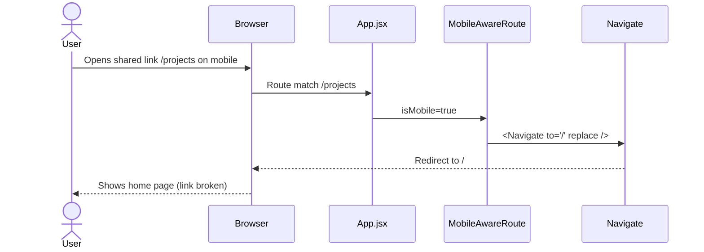
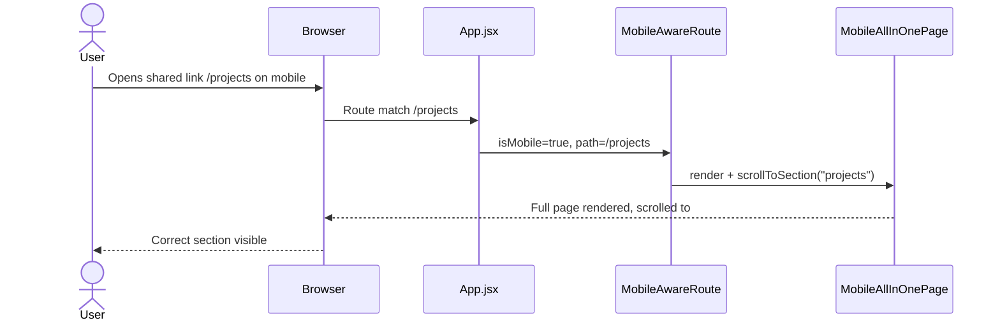
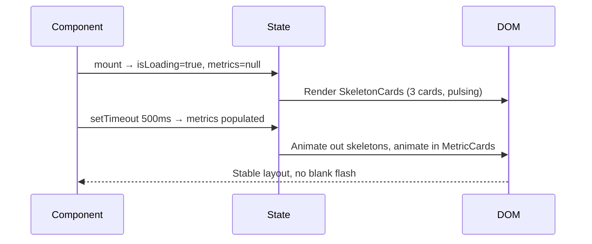
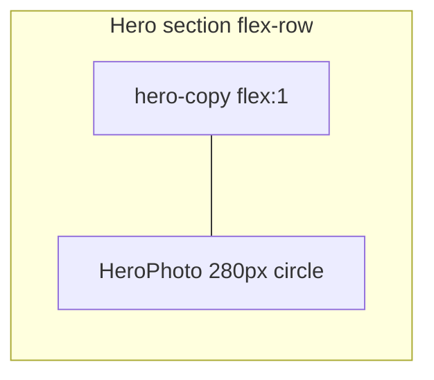
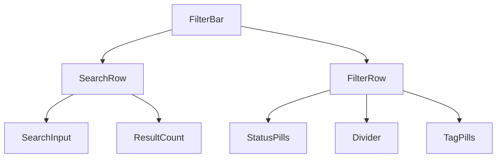
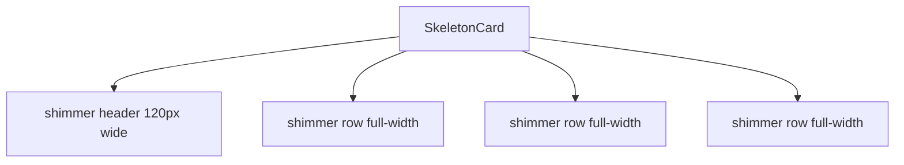

# Design Document: Portfolio UI/UX Overhaul

## Overview

This feature addresses six concrete UI/UX regressions and gaps identified in the React portfolio codebase: a collapsed color token system that maps every semantic color to the same blue, missing surface depth in light mode, an absent hero profile photo, a fragmented three-layer filter UI on the Projects page, a mobile routing bug that silently redirects deep-linked sub-routes, and a blank-space flash in `LiveMetricsDashboard` while data loads. A secondary concern is standardising the `PageHeader` bottom-spacing contract so all pages feel rhythmically consistent.

The approach is surgical: each fix is scoped to the smallest possible change surface, avoids introducing new dependencies, and preserves the existing inline-style + CSS-variable architecture. No design-system migration is required; the changes are additive token additions, component-level layout tweaks, and a routing strategy change.

## Architecture

```mermaid
graph TD
    subgraph CSS Layer
        A[index.css — token definitions] --> B[All components via var()]
    end

    subgraph Routing Layer
        C[App.jsx — MobileAwareRoute] --> D[MobileAllInOnePage]
        C --> E[ProjectsPage / SkillsPage / etc.]
    end

    subgraph Component Layer
        F[Hero.jsx] --> G[himanshu.jpg via /public]
        H[ProjectsPage.jsx — FilterBar] --> I[search + status + tags]
        J[LiveMetricsDashboard.jsx] --> K[SkeletonCard]
        L[PageHeader.jsx] --> M[marginBottom prop]
    end

    A -->|--green --yellow --red --pink| F
    A -->|--surface --surface2 light mode| H
    C -->|navigate-aware redirect| D
```

## Sequence Diagrams

### Mobile Deep-Link Flow (Current — Broken)



### Mobile Deep-Link Flow (Fixed)



### LiveMetricsDashboard Loading Flow (Fixed)



## Components and Interfaces

### 1. CSS Token Layer (`index.css`)

**Purpose**: Provide semantically distinct color tokens for status/category differentiation and fix light-mode surface depth.

**Changes**:

```css
/* Dark mode — semantic palette */
:root {
  --green:  #4ade80;   /* success, published, live */
  --yellow: #facc15;   /* warning, in-progress */
  --red:    #f87171;   /* error, deprecated */
  --pink:   #f472b6;   /* highlight, featured */

  --surface:  #222222;
  --surface2: #2a2a2a; /* already distinct — no change needed */

  --radius-sm: 6px;
  --radius-md: 10px;
  --radius-lg: 16px;

  --shadow-sm: 0 1px 3px rgba(0,0,0,0.18), 0 1px 2px rgba(0,0,0,0.12);
  --shadow-md: 0 4px 16px rgba(0,0,0,0.22), 0 2px 6px rgba(0,0,0,0.14);
}

/* Light mode — fix invisible cards */
:root[data-theme="light"] {
  --green:  #16a34a;
  --yellow: #ca8a04;
  --red:    #dc2626;
  --pink:   #db2777;

  --surface:  #ffffff;   /* cards: white */
  --surface2: #f4f4f5;   /* subtle inner surface */

  --shadow-sm: 0 1px 3px rgba(0,0,0,0.07), 0 1px 2px rgba(0,0,0,0.05);
  --shadow-md: 0 4px 16px rgba(0,0,0,0.10), 0 2px 6px rgba(0,0,0,0.06);
}
```

**Responsibilities**:
- Provide `--green`, `--yellow`, `--red`, `--pink` as semantically distinct values in both themes
- Ensure `--surface` ≠ `--bg` in light mode so cards are visible without inline overrides
- Provide non-zero `--radius-*` and non-`none` `--shadow-*` so components that reference them get sensible defaults

---

### 2. Hero Component (`Hero.jsx`)

**Purpose**: Add profile photo alongside the existing text copy for improved personal branding.

**Interface**:

```typescript
// No prop changes — photo is sourced from /public/himanshu.jpg
function Hero(): JSX.Element
```

**Layout**:



**Photo sub-component**:

```typescript
interface HeroPhotoProps {
  src: string        // "/himanshu.jpg"
  alt: string        // "Himanshu Nakrani"
  size?: number      // default 280 (desktop), 180 (mobile via CSS)
}
```

**Responsibilities**:
- Render `` in a circular frame
- Apply `object-fit: cover` and a subtle border using `var(--border2)`
- On mobile (`max-width: 768px`) reduce to 180 px and center above the copy block
- Lazy-load with `loading="lazy"` and provide explicit `width`/`height` to avoid CLS

---

### 3. Projects Filter Bar (`ProjectsPage.jsx`)

**Purpose**: Consolidate three vertically-stacked filter mechanisms into a single visually-grouped control area to reduce cognitive load.

**Current structure** (three separate blocks):
1. `<input>` search field
2. Status badge pills (All / Production / In Progress / Open Source)
3. Tag pills (All + dynamic tags from data)

**Proposed structure**:



**Interface**:

```typescript
interface FilterBarProps {
  query: string
  onQueryChange: (q: string) => void
  activeFilter: string
  onFilterChange: (f: string) => void
  activeTag: string
  onTagChange: (t: string) => void
  allTags: string[]
  resultCount: number
  totalCount: number
}
```

**Responsibilities**:
- Wrap all three controls in a single `<div>` with a shared border and background (`var(--surface)`)
- Search input sits in its own row with the result count inline on the right
- Status pills and tag pills share a second row, separated by a `1px` vertical divider
- On mobile, the two pill rows stack vertically within the same container
- Active state styling remains unchanged (accent color fill)

---

### 4. Mobile Routing (`App.jsx`)

**Purpose**: Allow users who land on `/projects`, `/skills`, etc. on a mobile device to see the correct content instead of being silently redirected to `/`.

**Current behaviour**: `MobileAwareRoute` renders `<Navigate to="/" replace />` for any sub-route on mobile.

**Proposed behaviour**: `MobileAwareRoute` renders `MobileAllInOnePage` and passes the target section ID so the page can scroll to it after mount.

**Interface**:

```typescript
interface MobileAwareRouteProps {
  component: React.ComponentType   // kept for desktop
  sectionId?: string               // e.g. "projects", "skills"
}
```

**`MobileAllInOnePage` scroll contract**:

```typescript
interface MobileAllInOnePageProps {
  scrollToSection?: string   // section id to scroll to on mount
}
```

**Scroll logic** (inside `MobileAllInOnePage`):

```typescript
useEffect(() => {
  if (!scrollToSection) return
  // Wait one frame for layout to settle
  requestAnimationFrame(() => {
    const el = document.getElementById(scrollToSection)
    if (el) el.scrollIntoView({ behavior: 'smooth', block: 'start' })
  })
}, [scrollToSection])
```

**Route table** (updated `App.jsx`):

```typescript
const mobileRouteMap: Record<string, string> = {
  '/projects':   'projects',
  '/experience': 'experience',
  '/profiles':   'profiles',
  '/research':   'research',
  '/skills':     'skills',
}
```

**Responsibilities**:
- On mobile, render `MobileAllInOnePage` for all sub-routes (no redirect)
- Pass the mapped `sectionId` so the page scrolls to the right section
- On desktop, behaviour is unchanged (renders the dedicated page component)

---

### 5. LiveMetricsDashboard Skeleton (`LiveMetricsDashboard.jsx`)

**Purpose**: Eliminate the blank-space flash between mount and data arrival by showing skeleton placeholder cards.

**Interface**:

```typescript
interface SkeletonCardProps {
  rows?: number   // number of stat rows to fake, default 3
}

// Internal state shape
interface DashboardState {
  isLoading: boolean
  metrics: MetricsData | null
}
```

**Skeleton card structure**:



**Shimmer animation** (CSS keyframe, added to `index.css`):

```css
@keyframes shimmer {
  0%   { background-position: -400px 0; }
  100% { background-position:  400px 0; }
}

.skeleton-shimmer {
  background: linear-gradient(
    90deg,
    var(--surface) 25%,
    var(--surface2) 50%,
    var(--surface) 75%
  );
  background-size: 800px 100%;
  animation: shimmer 1.4s infinite linear;
  border-radius: var(--radius-sm);
}
```

**State machine**:

```
mount → isLoading=true
      → render SkeletonCard × 3
      → setTimeout(500ms)
      → isLoading=false, metrics=populated
      → render MetricCard × 3 with entry animation
```

**Responsibilities**:
- Show `SkeletonCard` components while `isLoading === true`
- Match the exact grid layout of the real cards so no layout shift occurs on reveal
- Transition from skeleton to real cards using Framer Motion `AnimatePresence`

---

### 6. PageHeader Spacing (`PageHeader.jsx`)

**Purpose**: Standardise the bottom spacing between the lede text and the page content that follows.

**Current issue**: `marginBottom` defaults to `'2.25rem'` on the `<header>` wrapper, but the lede `<p>` has no bottom margin of its own. Pages that pass a custom `marginBottom` get inconsistent spacing depending on whether a description is present.

**Proposed contract**:

```typescript
interface PageHeaderProps {
  kicker?: string
  title: string
  description?: string
  marginBottom?: string   // default: '2.5rem' (slightly increased for breathing room)
}
```

**CSS class update** (`index.css`):

```css
.mvp2-page-lede {
  color: var(--text2);
  max-width: 40rem;
  font-size: 1.05rem;
  line-height: 1.7;
  font-weight: 400;
  margin-top: 0.5rem;   /* ADD: consistent gap between title and lede */
}
```

**Responsibilities**:
- `marginBottom` on the `<header>` wrapper controls spacing to the first content block
- Default raised from `2.25rem` → `2.5rem` for consistent breathing room
- `margin-top: 0.5rem` on `.mvp2-page-lede` ensures title-to-lede gap is always present

## Data Models

### Color Token Map

```typescript
type ColorToken = '--green' | '--yellow' | '--red' | '--pink'

interface ThemeTokens {
  // Semantic status colors
  green:  string   // success / published / live
  yellow: string   // warning / in-progress / pending
  red:    string   // error / deprecated / blocked
  pink:   string   // highlight / featured / special

  // Surface depth
  surface:  string   // card background (must differ from --bg in light mode)
  surface2: string   // inner surface / subtle variant

  // Elevation
  shadowSm: string
  shadowMd: string

  // Border radius
  radiusSm: string
  radiusMd: string
  radiusLg: string
}
```

### Filter State

```typescript
interface ProjectFilterState {
  query: string          // free-text search
  activeFilter: string   // 'All' | 'Production' | 'In Progress' | 'Open Source'
  activeTag: string      // 'All' | any tag string from data
}
```

### Mobile Route Map

```typescript
type PathSegment = '/projects' | '/experience' | '/profiles' | '/research' | '/skills'
type SectionId   = 'projects'  | 'experience'  | 'profiles'  | 'research'  | 'skills'

const mobileRouteMap: Record<PathSegment, SectionId>
```

## Algorithmic Pseudocode

### Mobile Route Resolution

```pascal
ALGORITHM resolveMobileRoute(pathname, isMobile)
INPUT:  pathname  — current URL path string
        isMobile  — boolean from useIsMobile hook
OUTPUT: ReactElement

BEGIN
  IF NOT isMobile THEN
    RETURN <Component />   // dedicated page, unchanged
  END IF

  sectionId ← mobileRouteMap[pathname]   // may be undefined for "/"

  RETURN <MobileAllInOnePage scrollToSection=sectionId />
END
```

**Preconditions:**
- `pathname` is a valid route registered in `App.jsx`
- `isMobile` reflects the current viewport accurately

**Postconditions:**
- Mobile users always see `MobileAllInOnePage` (no redirect)
- If `sectionId` is defined, the page scrolls to that section after mount
- Desktop users see the dedicated page component unchanged

---

### Skeleton → Content Transition

```pascal
ALGORITHM renderDashboard(isLoading, metrics)
INPUT:  isLoading — boolean
        metrics   — MetricsData | null
OUTPUT: ReactElement

BEGIN
  IF isLoading THEN
    RETURN
      <AnimatePresence>
        FOR i IN [0, 1, 2] DO
          YIELD <SkeletonCard key=i rows=3 />
        END FOR
      </AnimatePresence>
  ELSE
    RETURN
      <AnimatePresence>
        FOR card IN buildCards(metrics) DO
          YIELD <MetricCard card=card />
        END FOR
      </AnimatePresence>
  END IF
END
```

**Preconditions:**
- `isLoading` is `true` on mount
- `metrics` is `null` until the async operation resolves

**Postconditions:**
- No blank space is ever rendered; skeleton occupies the same grid area as real cards
- Transition is animated via `AnimatePresence` exit/enter

---

### Filter Bar Consolidation

```pascal
ALGORITHM applyFilters(projects, filterState)
INPUT:  projects    — Project[]
        filterState — { query, activeFilter, activeTag }
OUTPUT: Project[]

BEGIN
  result ← projects

  IF filterState.query ≠ "" THEN
    result ← result WHERE
      title.toLowerCase() CONTAINS query.toLowerCase()
      OR desc.toLowerCase() CONTAINS query.toLowerCase()
  END IF

  IF filterState.activeFilter ≠ "All" THEN
    result ← result WHERE matchesBadgeFilter(p, activeFilter)
  END IF

  IF filterState.activeTag ≠ "All" THEN
    result ← result WHERE p.tags CONTAINS activeTag
  END IF

  RETURN result
END
```

**Preconditions:**
- `projects` is the full unfiltered array from `data.js`
- All three filter dimensions are independent (AND logic)

**Postconditions:**
- Returns a subset (possibly empty) of the input array
- Order of items is preserved from the source array

## Key Functions with Formal Specifications

### `MobileAwareRoute` (updated)

```typescript
function MobileAwareRoute({
  component: Component,
  sectionId,
}: MobileAwareRouteProps): JSX.Element
```

**Preconditions:**
- `Component` is a valid React component
- `sectionId` is either `undefined` (for `/`) or a string matching an `id` attribute in `MobileAllInOnePage`

**Postconditions:**
- If `isMobile === false`: renders `<Component />`
- If `isMobile === true`: renders `<MobileAllInOnePage scrollToSection={sectionId} />`
- No `<Navigate>` is ever rendered; no URL change occurs

**Loop Invariants:** N/A

---

### `SkeletonCard`

```typescript
function SkeletonCard({ rows = 3 }: SkeletonCardProps): JSX.Element
```

**Preconditions:**
- `rows` is a positive integer ≤ 5

**Postconditions:**
- Renders a card-shaped placeholder with `rows` shimmer lines
- Dimensions match the real `MetricCard` so no layout shift occurs on swap
- Uses `.skeleton-shimmer` CSS class for animation

**Loop Invariants:**
- For each row index `i` in `[0, rows)`: a shimmer `<div>` is rendered with `key=i`

---

### `FilterBar` (extracted component)

```typescript
function FilterBar(props: FilterBarProps): JSX.Element
```

**Preconditions:**
- `allTags` contains at least `['All']`
- `resultCount` ≤ `totalCount`

**Postconditions:**
- Renders a single visually-grouped container with search, status pills, and tag pills
- Calls the appropriate `onChange` handler when user interacts with any control
- `resultCount` is displayed inline with the search input

---

### `HeroPhoto`

```typescript
function HeroPhoto({ src, alt, size = 280 }: HeroPhotoProps): JSX.Element
```

**Preconditions:**
- `src` resolves to an existing image in `/public`
- `alt` is a non-empty descriptive string

**Postconditions:**
- Renders an `` with `loading="lazy"`, explicit `width` and `height` equal to `size`
- Image is clipped to a circle via `borderRadius: '50%'`
- On viewport ≤ 768 px, CSS overrides size to 180 px and centers the element

## Example Usage

### Updated `App.jsx` route table

```tsx
// Route map for mobile section scrolling
const mobileRouteMap = {
  '/projects':   'projects',
  '/experience': 'experience',
  '/profiles':   'profiles',
  '/research':   'research',
  '/skills':     'skills',
}

function MobileAwareRoute({ component: Component, sectionId }) {
  const isMobile = useIsMobile()
  return isMobile
    ? <MobileAllInOnePage scrollToSection={sectionId} />
    : <Component />
}

// Inside <Routes>:
<Route path="/projects"   element={<MobileAwareRoute component={ProjectsPage}   sectionId="projects"   />} />
<Route path="/experience" element={<MobileAwareRoute component={ExperiencePage} sectionId="experience" />} />
<Route path="/skills"     element={<MobileAwareRoute component={SkillsPage}     sectionId="skills"     />} />
```

### `MobileAllInOnePage` scroll-on-mount

```tsx
export default function MobileAllInOnePage({ scrollToSection }) {
  useEffect(() => {
    if (!scrollToSection) return
    requestAnimationFrame(() => {
      const el = document.getElementById(scrollToSection)
      if (el) el.scrollIntoView({ behavior: 'smooth', block: 'start' })
    })
  }, [scrollToSection])

  return (
    <>
      <Hero />
      {/* ... all sections with matching id attributes ... */}
    </>
  )
}
```

### `LiveMetricsDashboard` with skeleton

```tsx
export default function LiveMetricsDashboard() {
  const [isLoading, setIsLoading] = useState(true)
  const [metrics, setMetrics] = useState(null)

  useEffect(() => {
    const timer = setTimeout(() => {
      setMetrics({ github: {...}, kaggle: {...}, leetcode: {...} })
      setIsLoading(false)
    }, 500)
    return () => clearTimeout(timer)
  }, [])

  return (
    <div style={{ display: 'grid', gridTemplateColumns: 'repeat(auto-fit, minmax(280px, 1fr))', gap: '1.5rem' }}>
      <AnimatePresence mode="wait">
        {isLoading
          ? [0,1,2].map(i => <SkeletonCard key={i} rows={3} />)
          : cards.map((card, i) => <MetricCard key={card.title} card={card} index={i} />)
        }
      </AnimatePresence>
    </div>
  )
}
```

### Hero with profile photo

```tsx
export default function Hero() {
  return (
    <section id="about" style={{ display: 'flex', alignItems: 'center', gap: 'clamp(2rem,6vw,5rem)', ... }}>
      <div className="hero-copy" style={{ flex: 1 }}>
        {/* existing copy unchanged */}
      </div>

      <HeroPhoto src="/himanshu.jpg" alt="Himanshu Nakrani" size={280} />

      <style>{`
        @media (max-width: 768px) {
          #about { flex-direction: column !important; }
          .hero-photo { width: 180px !important; height: 180px !important; align-self: center; }
        }
      `}</style>
    </section>
  )
}
```

### Consolidated `FilterBar` usage in `ProjectsPage`

```tsx
<FilterBar
  query={query}
  onQueryChange={setQuery}
  activeFilter={activeFilter}
  onFilterChange={setActiveFilter}
  activeTag={activeTag}
  onTagChange={setActiveTag}
  allTags={allTags}
  resultCount={filteredProjects.length}
  totalCount={projects.length}
/>
```

## Correctness Properties

### Color Token Differentiation

- For every semantic token `t ∈ {--green, --yellow, --red, --pink}` and every theme `θ ∈ {dark, light}`: `value(t, θ) ≠ value(--accent, θ)`
- For every pair of distinct tokens `(t1, t2)` in the semantic set: `value(t1, θ) ≠ value(t2, θ)` for all `θ`

### Light Mode Surface Depth

- In light mode: `value(--surface) ≠ value(--bg)` and `value(--surface2) ≠ value(--bg)`
- In light mode: `value(--surface) = '#ffffff'` and `value(--bg) = '#fafafa'`

### Mobile Routing

- For all paths `p ∈ mobileRouteMap.keys()` and `isMobile = true`: the rendered tree contains `MobileAllInOnePage`, not `<Navigate>`
- For all paths `p` and `isMobile = false`: the rendered tree contains the dedicated `Component`, not `MobileAllInOnePage`
- No URL change occurs when a mobile user lands on a sub-route

### Skeleton Loading

- At `t=0` (mount): `isLoading === true` and the DOM contains skeleton elements, not metric values
- At `t>500ms`: `isLoading === false` and the DOM contains metric values, not skeleton elements
- The grid layout dimensions are identical between skeleton and real card states (no CLS)

### Filter Logic

- `filteredProjects.length ≤ projects.length` always
- If `query = ''` and `activeFilter = 'All'` and `activeTag = 'All'`: `filteredProjects = projects`
- Filter dimensions are independent: applying any single filter does not affect the others

### Hero Photo

- `` element with `src="/himanshu.jpg"` is present in the Hero section DOM
- `alt` attribute is non-empty
- `loading="lazy"` attribute is present

## Error Handling

### Hero Photo Load Failure

**Condition**: `/himanshu.jpg` fails to load (network error, missing file)
**Response**: Browser renders the `alt` text; no JS error is thrown
**Recovery**: No action needed — the layout degrades gracefully; the text copy remains fully visible

### Mobile Scroll Target Not Found

**Condition**: `scrollToSection` is set but `document.getElementById(sectionId)` returns `null`
**Response**: `scrollIntoView` is not called; page renders at the top
**Recovery**: User sees the full page from the top — acceptable fallback

### LiveMetricsDashboard Fetch Failure (future)

**Condition**: Real API call fails or times out
**Response**: `isLoading` is set to `false` with `metrics` remaining `null`; cards render with `'—'` placeholder values
**Recovery**: A retry button or auto-retry after 30 s can be added in a follow-up

### Filter Produces Zero Results

**Condition**: Combined filters match no projects
**Response**: Existing empty-state message ("No projects match your filters.") is shown
**Recovery**: User can clear individual filters; no error state needed

## Testing Strategy

### Unit Testing Approach

Each changed component should have a focused unit test:

- `MobileAwareRoute`: assert that `isMobile=true` renders `MobileAllInOnePage` (not `Navigate`), and that `sectionId` is passed through
- `SkeletonCard`: assert correct number of shimmer rows rendered for given `rows` prop
- `FilterBar`: assert that changing any control calls the correct `onChange` handler; assert result count display
- `HeroPhoto`: assert `src`, `alt`, `loading` attributes are present
- `PageHeader`: assert `marginBottom` prop is applied to the wrapper element

### Property-Based Testing Approach

**Property Test Library**: fast-check

- `applyFilters(projects, state)`: for any `state`, result length is always ≤ `projects.length`
- `applyFilters(projects, { query:'', activeFilter:'All', activeTag:'All' })`: result always equals full `projects` array
- Color token uniqueness: for any two distinct semantic tokens, their resolved CSS values differ

### Integration Testing Approach

- Navigate to `/projects` in a mobile viewport (375 px): assert `#projects` section is in view
- Navigate to `/skills` in a mobile viewport: assert `#skills` section is in view
- Mount `LiveMetricsDashboard`: assert skeleton is visible at `t=0`, real cards visible at `t=600ms`
- Toggle theme to light: assert card backgrounds are visually distinct from page background (computed style check)

## Performance Considerations

- Hero photo uses `loading="lazy"` and explicit `width`/`height` to avoid Cumulative Layout Shift (CLS)
- `SkeletonCard` uses CSS animation (GPU-composited `background-position`) rather than JS-driven animation
- `FilterBar` extraction does not add a new render boundary; state remains in `ProjectsPage` to avoid prop-drilling overhead
- `MobileAllInOnePage` scroll uses `requestAnimationFrame` to defer until after paint, avoiding forced reflow

## Security Considerations

- Profile photo is served from `/public` (static asset) — no user-supplied URL, no XSS vector
- Filter inputs use controlled React state; no `dangerouslySetInnerHTML` is involved
- Mobile routing change does not expose any new routes or bypass authentication (portfolio is public)

## Dependencies

No new dependencies are introduced. All changes use:
- React 18 (hooks: `useState`, `useEffect`, `useRef`)
- Framer Motion (already installed) — `AnimatePresence` for skeleton transition
- React Router v6 (already installed) — `useLocation` for route-aware scroll
- CSS custom properties (already in use) — token additions only
