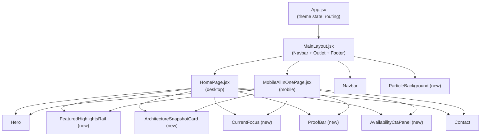
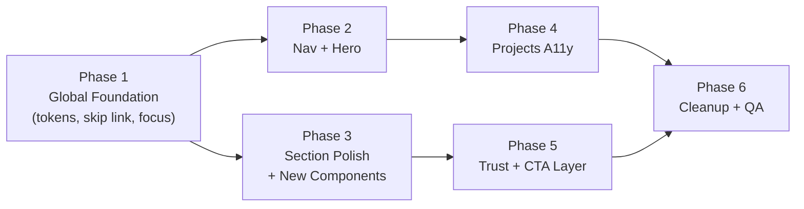
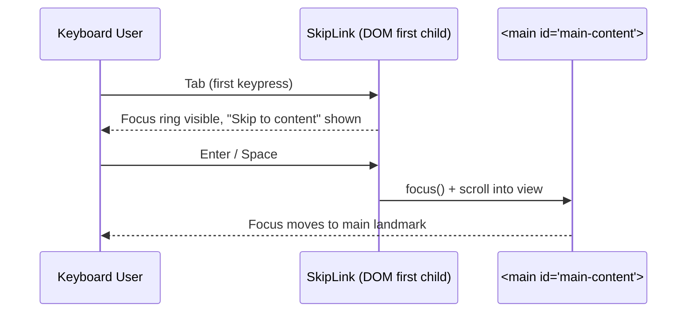

# Design Document: UI/UX Accessibility Revamp

## Overview

This revamp transforms the existing React portfolio from an engineer-built site into a deliberately refined product experience. The work spans six phases: global accessibility foundation, navigation and hero polish, section and content restructuring, projects accessibility, trust and CTA layer, and React cleanup. All changes preserve the existing content, brand tone, and static deployment model while making the site fully keyboard-operable, screen-reader friendly, and visually consistent across desktop and mobile.

The approach is additive where possible — new components slot into the existing `HomePage` and `MobileAllInOnePage` composition model, existing components are hardened in place, and the CSS token system is extended rather than replaced. The `LiveMetricsDashboard` is de-emphasized in favor of a `FeaturedHighlightsRail` that surfaces higher-signal proof points.

## Architecture

### Component Composition Model



### Phase Dependency Graph




## Phase 1: Global Foundation

### Sequence: Skip Link + Focus Styles



### CSS Token Extensions (index.css)

New tokens to add to `:root` and both theme overrides:

```css
/* Focus */
--focus-ring: 2px solid var(--accent);
--focus-ring-offset: 3px;
--focus-ring-radius: var(--radius-sm);

/* Interactive state */
--interactive-hover-bg: color-mix(in srgb, var(--accent) 8%, transparent);
--interactive-active-bg: color-mix(in srgb, var(--accent) 14%, transparent);

/* Border contrast boost */
--border-strong: #555555;          /* dark theme */
--border-interactive: var(--accent);

/* Particle layer */
--particle-opacity: 0.35;
--particle-color: var(--accent);
```

Light theme overrides:
```css
--border-strong: #c0c0c0;
--particle-opacity: 0.18;
```

### Global Focus Rule (index.css)

```css
:focus-visible {
  outline: var(--focus-ring);
  outline-offset: var(--focus-ring-offset);
  border-radius: var(--focus-ring-radius);
}

/* Remove default outline only when :focus-visible is supported */
:focus:not(:focus-visible) {
  outline: none;
}
```

### Semantic Landmark Audit

| Element | Current | Target |
|---|---|---|
| `<header>` | `<header>` in MainLayout footer area | Navbar wraps in `<header>` with `role="banner"` |
| `<nav>` | `<ul>` inside Navbar | Wrap nav links in `<nav aria-label="Main navigation">` |
| `<main>` | `<main>` in MainLayout | Add `id="main-content"` for skip link target |
| `<footer>` | `<footer>` in MainLayout | Add `role="contentinfo"` |
| Section headings | `<h2>` in Section.jsx | Audit: Hero h1, sections h2, cards h3 |

### SkipLink Component Interface

```typescript
// src/components/SkipLink.jsx
interface SkipLinkProps {
  targetId: string   // "main-content"
}
```

Renders as the first child of `<body>` via `MainLayout`. Visually hidden until focused; appears at top-left on focus.

```css
.skip-link {
  position: absolute;
  top: -100%;
  left: 1rem;
  z-index: 9999;
  padding: 0.75rem 1.25rem;
  background: var(--accent);
  color: white;
  border-radius: 0 0 var(--radius-md) var(--radius-md);
  font-weight: 600;
  text-decoration: none;
  transition: top 0.15s ease;
}
.skip-link:focus {
  top: 0;
}
```


## Phase 2: Navigation and Hero

### Navbar Accessibility Improvements

#### Mobile Menu Toggle — ARIA State

```typescript
// Current (missing aria-expanded)
<button aria-label={open ? 'Close menu' : 'Open menu'}>

// Target
<button
  type="button"
  aria-label="Toggle navigation menu"
  aria-expanded={open}
  aria-controls="mobile-nav-menu"
>

// Mobile menu panel
<ul id="mobile-nav-menu" role="list" aria-label="Navigation links">
```

#### Desktop Nav Active State

Current: dot indicator below label (visual only).
Target: add `aria-current="page"` on the active `NavLink` and strengthen the visual indicator.

```typescript
// isPageActive() returns boolean — pass to NavLink
<NavLink
  aria-current={isPageActive(item.label) ? 'page' : undefined}
  ...
>
```

Active style upgrade: replace dot-only indicator with a subtle background pill:

```css
/* active nav item */
background: color-mix(in srgb, var(--accent) 10%, transparent);
color: var(--text);
border-radius: 9999px;
padding: 4px 12px;
```

#### Anchored Scroll — Header Offset

`scroll-margin-top` is already set on `section[id]`. Verify the value matches the actual navbar height (52px pill + 12px padding top = ~76px). Add a CSS custom property so it's maintainable:

```css
:root { --navbar-height: 76px; }
section[id] { scroll-margin-top: var(--navbar-height); }
@media (max-width: 768px) {
  :root { --navbar-height: 72px; }
}
```

### Hero Hierarchy Improvements

#### Information Architecture

```
[kicker: role label]
[h1: name]
[value proposition: 1-2 sentences]
[primary CTA button]  [secondary CTA link]
[stats row]
[photo]
```

Current hero has links styled as plain underline text. Target: promote the primary action to a proper `<button>`/`<a>` with button styling, and add a secondary ghost variant.

#### Hero CTA Interface

```typescript
interface HeroCTA {
  primary: { label: string; href: string }   // e.g. "View Projects" → /projects
  secondary: { label: string; href: string } // e.g. "Download Resume" → /resume.pdf
}
```

#### Reduced Motion — Hero Animations

Current `fadeInUp` keyframe animation on stats runs unconditionally. Wrap in media query:

```css
@media (prefers-reduced-motion: no-preference) {
  .hero-stat { animation: fadeInUp 0.6s ease forwards; }
}
@media (prefers-reduced-motion: reduce) {
  .hero-stat { opacity: 1; transform: none; }
}
```

#### Hero Photo Alt Text

```typescript
// Current


// Target — more descriptive

```


## Phase 3: Section and Content Polish

### HomePage Composition — Before / After

```
BEFORE:
  Hero → AboutBrief → TechStack → LiveMetricsDashboard → Contact

AFTER:
  Hero → ProofBar → FeaturedHighlightsRail → ArchitectureSnapshotCard
       → CurrentFocus → TechStack → AvailabilityCtaPanel → Contact
```

`LiveMetricsDashboard` is moved to `ProfilesPage` only (still accessible, just not the primary proof device on the home page).

### New Component: FeaturedHighlightsRail

#### Purpose
Replace `LiveMetricsDashboard` as the primary proof section on `HomePage`. Surfaces 3–5 high-signal proof points as scannable cards.

#### Data Model

```typescript
interface Highlight {
  id: string
  icon: string           // emoji or lucide icon name
  category: string       // "Production AI" | "Research" | "Performance" | "Enterprise"
  headline: string       // short, punchy — max ~60 chars
  subtext: string        // supporting detail — max ~100 chars
  metric?: string        // optional bold number/stat e.g. "75% latency reduction"
  link?: string          // optional external link
}
```

Example data (lives in `src/data.js`):

```javascript
export const featuredHighlights = [
  {
    id: 'alpha-copilot',
    icon: '🤖',
    category: 'Production AI',
    headline: 'Alpha Copilot — LLM system serving 100+ users',
    subtext: 'Text-to-SQL + RAG pipeline deployed at State Street Corporation',
    metric: '100+ users',
  },
  {
    id: 'latency',
    icon: '⚡',
    category: 'Performance',
    headline: '75% query latency reduction',
    subtext: 'Optimized retrieval pipeline via hybrid search and prompt caching',
    metric: '75% faster',
  },
  {
    id: 'research',
    icon: '📄',
    category: 'Research',
    headline: 'IEEE published — Text-to-SQL & Graph-of-Thoughts',
    subtext: 'Peer-reviewed research on structured query generation with LLMs',
    metric: '2 publications',
  },
]
```

#### Component Interface

```typescript
// src/components/FeaturedHighlightsRail.jsx
interface FeaturedHighlightsRailProps {
  highlights: Highlight[]   // from data.js
}
```

#### Layout Algorithm

```pascal
PROCEDURE renderFeaturedHighlightsRail(highlights)
  INPUT: highlights array (3-5 items)
  OUTPUT: horizontal scrollable rail on mobile, grid on desktop

  SEQUENCE
    container ← <section aria-label="Featured highlights">
    
    FOR each highlight IN highlights DO
      card ← <article>
        header ← icon + category badge
        body   ← headline (h3) + subtext
        footer ← metric chip (if present) + optional link
      END article
      
      IF highlight.link IS NOT NULL THEN
        wrap card in <a href={link} target="_blank" rel="noopener">
        add aria-label = "{headline} (opens in new tab)"
      END IF
      
      container.append(card)
    END FOR
    
    RETURN container
  END SEQUENCE
END PROCEDURE
```

#### Responsive Layout

```css
.highlights-rail {
  display: grid;
  grid-template-columns: repeat(auto-fill, minmax(260px, 1fr));
  gap: 1rem;
}

@media (max-width: 640px) {
  .highlights-rail {
    display: flex;
    overflow-x: auto;
    scroll-snap-type: x mandatory;
    gap: 0.875rem;
    padding-bottom: 0.5rem;
  }
  .highlights-rail > * {
    flex: 0 0 min(280px, 80vw);
    scroll-snap-align: start;
  }
}
```

### New Component: ProofBar

#### Purpose
Fast access to trust-building external profiles. Minimal, premium — not a social icon strip.

#### Data Model

```typescript
interface ProofLink {
  label: string
  href: string
  sublabel?: string   // e.g. "Expert" for Kaggle rank
  icon?: string       // lucide icon name
}
```

#### Component Interface

```typescript
// src/components/ProofBar.jsx
interface ProofBarProps {
  links: ProofLink[]
}
```

#### Layout Algorithm

```pascal
PROCEDURE renderProofBar(links)
  INPUT: links array
  OUTPUT: horizontal bar of labeled links with subtle separators

  SEQUENCE
    bar ← <nav aria-label="External profiles and proof links">
    
    FOR each link IN links DO
      item ← <a href={link.href} target="_blank" rel="noopener noreferrer"
                 aria-label="{link.label}{link.sublabel ? ', ' + link.sublabel : ''}">
        <span class="proof-label">{link.label}</span>
        IF link.sublabel THEN
          <span class="proof-sublabel">{link.sublabel}</span>
        END IF
      </a>
      
      bar.append(item)
      IF NOT last item THEN bar.append(<span aria-hidden="true" class="proof-sep">·</span>)
    END FOR
    
    RETURN bar
  END SEQUENCE
END PROCEDURE
```

### New Component: ArchitectureSnapshotCard

#### Purpose
Visualize a representative AI system pipeline to communicate systems thinking.

#### Pipeline Data Model

```typescript
interface PipelineStage {
  id: string
  label: string       // "Ingestion" | "Retrieval" | "Prompt Orchestration" | "Evaluation" | "Delivery"
  icon: string        // emoji
  detail?: string     // short tooltip/subtext
}

interface ArchitecturePipeline {
  title: string
  stages: PipelineStage[]
  connections: Array<[string, string]>  // [fromId, toId]
}
```

#### Layout Algorithm

```pascal
PROCEDURE renderArchitectureSnapshotCard(pipeline)
  INPUT: pipeline with stages and connections
  OUTPUT: horizontal flow diagram, wraps to 2-row on mobile

  SEQUENCE
    card ← <section aria-label="Architecture snapshot: {pipeline.title}">
    
    stageElements ← []
    FOR each stage IN pipeline.stages DO
      el ← <div role="img" aria-label="{stage.label}: {stage.detail}">
        icon + label
      </div>
      stageElements.append(el)
    END FOR
    
    // Render stages with arrow connectors between them
    // On mobile: wrap into 2 columns with vertical arrows
    // On desktop: single horizontal row with → connectors
    
    RETURN card
  END SEQUENCE
END PROCEDURE
```

#### Reduced Motion

Arrow connectors use CSS `transition` for draw-in animation. Wrap in:
```css
@media (prefers-reduced-motion: no-preference) {
  .arch-connector { animation: drawIn 0.4s ease forwards; }
}
```

### New Component: CurrentFocus

#### Data Model

```typescript
interface FocusItem {
  area: string        // "Researching" | "Building" | "Optimizing"
  description: string
  tags?: string[]
}
```

#### Component Interface

```typescript
// src/components/CurrentFocus.jsx
interface CurrentFocusProps {
  items: FocusItem[]   // 2-3 items from data.js
  lastUpdated?: string // "June 2025"
}
```


## Phase 4: Projects Accessibility

### FilterBar Accessibility Improvements

#### Search Input — Accessible Name

```typescript
// Current: no label, only placeholder
<input placeholder="Search projects..." />

// Target: explicit label (visually hidden is acceptable)
<label htmlFor="project-search" className="sr-only">Search projects</label>
<input
  id="project-search"
  type="search"
  placeholder="Search projects..."
  aria-label="Search projects"
  aria-describedby="project-count"
/>
<span id="project-count" aria-live="polite" aria-atomic="true">
  {resultCount} of {totalCount} projects
</span>
```

#### Filter Pills — Role and State

```typescript
// Current: <button> with visual active state only
// Target: add aria-pressed for toggle semantics

<button
  aria-pressed={activeFilter === f}
  onClick={() => onFilterChange(f)}
>
  {f}
</button>
```

#### Filter Group — Fieldset/Legend Pattern

```pascal
PROCEDURE renderFilterBar(props)
  SEQUENCE
    <div role="search" aria-label="Filter and search projects">
      // Search row
      <label htmlFor="project-search" className="sr-only">Search projects</label>
      <input id="project-search" type="search" ... />
      <span id="project-count" aria-live="polite">{resultCount} of {totalCount}</span>
      
      // Status filter group
      <fieldset>
        <legend className="sr-only">Filter by status</legend>
        FOR each status IN ['All', 'Production', 'In Progress', 'Open Source'] DO
          <button role="radio" aria-checked={activeFilter === status}>
            {status}
          </button>
        END FOR
      </fieldset>
      
      // Tag filter group
      <fieldset>
        <legend className="sr-only">Filter by technology tag</legend>
        FOR each tag IN allTags DO
          <button aria-pressed={activeTag === tag}>{tag}</button>
        END FOR
      </fieldset>
    </div>
  END SEQUENCE
END PROCEDURE
```

### ProjectCard — Keyboard Operability

```typescript
// Current: <motion.article onClick={onClick}> — not keyboard accessible
// Target: use <button> semantics or add keyboard handler

// Option A: wrap in button (cleanest for a11y)
<motion.article
  role="button"
  tabIndex={0}
  aria-label={`View details for ${item.title}`}
  onClick={onClick}
  onKeyDown={(e) => {
    if (e.key === 'Enter' || e.key === ' ') {
      e.preventDefault()
      onClick()
    }
  }}
>
```

### ProjectModal — Focus Management

```pascal
PROCEDURE openModal(project)
  SEQUENCE
    setSelected(project)
    
    // After render, move focus to modal
    requestAnimationFrame(() => {
      modalRef.current?.focus()
    })
  END SEQUENCE
END PROCEDURE

PROCEDURE closeModal()
  SEQUENCE
    setSelected(null)
    
    // Return focus to the card that opened the modal
    triggerRef.current?.focus()
  END SEQUENCE
END PROCEDURE

PROCEDURE handleModalKeyDown(event)
  IF event.key = 'Escape' THEN
    closeModal()
  END IF
  
  IF event.key = 'Tab' THEN
    // Trap focus within modal
    focusableElements ← modal.querySelectorAll(FOCUSABLE_SELECTOR)
    first ← focusableElements[0]
    last  ← focusableElements[focusableElements.length - 1]
    
    IF event.shiftKey AND document.activeElement = first THEN
      event.preventDefault()
      last.focus()
    ELSE IF NOT event.shiftKey AND document.activeElement = last THEN
      event.preventDefault()
      first.focus()
    END IF
  END IF
END PROCEDURE
```

#### Modal ARIA Attributes

```typescript
<div
  role="dialog"
  aria-modal="true"
  aria-labelledby="modal-title"
  tabIndex={-1}
  ref={modalRef}
  onKeyDown={handleModalKeyDown}
>
  <h2 id="modal-title">{project.title}</h2>
  <button aria-label="Close dialog" onClick={onClose}>✕</button>
  ...
</div>
```


## Phase 5: Trust and CTA Layer

### New Component: AvailabilityCtaPanel

#### Purpose
Strong end-of-page CTA communicating current availability, collaboration interest, and best next actions.

#### Data Model

```typescript
interface AvailabilityStatus {
  available: boolean
  statusLabel: string    // "Open to opportunities" | "Selectively available"
  description: string
  actions: Array<{
    label: string
    href: string
    variant: 'primary' | 'secondary' | 'ghost'
  }>
}
```

#### Component Interface

```typescript
// src/components/AvailabilityCtaPanel.jsx
interface AvailabilityCtaPanelProps {
  status: AvailabilityStatus
}
```

#### Layout Algorithm

```pascal
PROCEDURE renderAvailabilityCtaPanel(status)
  SEQUENCE
    panel ← <section aria-label="Availability and contact">
      
      // Status badge
      badge ← <span role="status" aria-label="Availability: {status.statusLabel}">
        <span aria-hidden="true" class="status-dot" />  // green pulse dot
        {status.statusLabel}
      </span>
      
      // Heading + description
      <h2>Let's build something.</h2>
      <p>{status.description}</p>
      
      // CTA buttons
      <div role="group" aria-label="Contact options">
        FOR each action IN status.actions DO
          <a href={action.href} class="cta-btn cta-btn--{action.variant}">
            {action.label}
          </a>
        END FOR
      </div>
      
    </section>
    
    RETURN panel
  END SEQUENCE
END PROCEDURE
```

### New Component: ParticleBackground

#### Purpose
Subtle ambient canvas layer behind page content. Must not degrade readability, contrast, or performance.

#### Component Interface

```typescript
// src/components/ParticleBackground.jsx
interface ParticleBackgroundProps {
  count?: number        // default 40 — reduced on mobile
  speed?: number        // default 0.3
  opacity?: number      // default from --particle-opacity CSS var
  color?: string        // default from --particle-color CSS var
}
```

#### Algorithm

```pascal
PROCEDURE initParticles(canvas, count, reduceMotion)
  IF reduceMotion = true THEN
    RETURN  // render nothing — respect user preference
  END IF
  
  ctx ← canvas.getContext('2d')
  particles ← []
  
  FOR i FROM 0 TO count DO
    particles.append({
      x: random(0, canvas.width),
      y: random(0, canvas.height),
      vx: random(-0.2, 0.2),
      vy: random(-0.15, 0.15),
      radius: random(1, 2.5),
      opacity: random(0.1, 0.4),
    })
  END FOR
  
  RETURN particles
END PROCEDURE

PROCEDURE animateFrame(ctx, particles, canvas)
  ctx.clearRect(0, 0, canvas.width, canvas.height)
  
  FOR each p IN particles DO
    p.x ← p.x + p.vx
    p.y ← p.y + p.vy
    
    // Wrap at edges
    IF p.x < 0 THEN p.x ← canvas.width END IF
    IF p.x > canvas.width THEN p.x ← 0 END IF
    IF p.y < 0 THEN p.y ← canvas.height END IF
    IF p.y > canvas.height THEN p.y ← 0 END IF
    
    ctx.beginPath()
    ctx.arc(p.x, p.y, p.radius, 0, 2π)
    ctx.fillStyle ← particleColor with p.opacity
    ctx.fill()
  END FOR
END PROCEDURE
```

#### Preconditions
- `useReducedMotion()` from framer-motion is checked before initializing canvas loop
- Canvas is `aria-hidden="true"` and `role="presentation"` — purely decorative
- Canvas is positioned `fixed`, `z-index: 0`, behind `#root` (`z-index: 1`)
- `pointer-events: none` so it never intercepts clicks

#### Performance Constraints
- `requestAnimationFrame` loop; cancelled on unmount via `cancelAnimationFrame`
- Particle count capped at 25 on mobile (`useIsMobile()`)
- Canvas resizes on `ResizeObserver` callback, not `window.resize` polling


## Phase 6: React Cleanup and Verification

### Lint Issues to Resolve

| File | Issue | Fix |
|---|---|---|
| `Contact.jsx` | Inline `onMouseEnter/Leave` mutate style directly | Replace with CSS class + `:hover` rule in `index.css` |
| `Hero.jsx` | `fadeInUp` animation not gated on `prefers-reduced-motion` | Move to `@media (prefers-reduced-motion: no-preference)` block |
| `ProjectsPage.jsx` | `<motion.article onClick>` not keyboard accessible | Add `role="button"`, `tabIndex`, `onKeyDown` |
| `Navbar.jsx` | Missing `aria-expanded` on mobile toggle | Add `aria-expanded={open}` |
| `LiveMetricsDashboard.jsx` | Hardcoded metric values (simulated) | Move to `data.js` or clearly mark as static |
| `App.jsx` | `handleThemeChange` calls `setAttribute` twice (once in handler, once in `useLayoutEffect`) | Remove redundant call in handler |

### Theme Consolidation

Current `App.jsx` calls `document.documentElement.setAttribute` in both `useLayoutEffect` and `handleThemeChange`. Consolidate:

```javascript
// App.jsx — single source of truth
useLayoutEffect(() => {
  document.documentElement.setAttribute('data-theme', isDark ? 'dark' : 'light')
  localStorage.setItem('theme', isDark ? 'dark' : 'light')
}, [isDark])

// handleThemeChange just sets state — effect handles DOM
const handleThemeChange = (newIsDark) => setIsDark(newIsDark)
```

### Shared CSS Utility Classes (index.css additions)

```css
/* Screen-reader only — visually hidden but accessible */
.sr-only {
  position: absolute;
  width: 1px;
  height: 1px;
  padding: 0;
  margin: -1px;
  overflow: hidden;
  clip: rect(0, 0, 0, 0);
  white-space: nowrap;
  border: 0;
}

/* Interactive card base — keyboard + mouse */
.interactive-card {
  cursor: pointer;
  transition: transform 0.2s ease, box-shadow 0.2s ease, border-color 0.2s ease;
}
.interactive-card:hover,
.interactive-card:focus-visible {
  transform: translateY(-2px);
  box-shadow: var(--shadow-md);
  border-color: var(--border2);
}

/* Button variants */
.btn {
  display: inline-flex;
  align-items: center;
  gap: 0.4rem;
  padding: 0.65rem 1.4rem;
  border-radius: 9999px;
  font-size: 0.875rem;
  font-weight: 600;
  text-decoration: none;
  cursor: pointer;
  transition: background 0.2s ease, border-color 0.2s ease, color 0.2s ease;
  border: 1px solid transparent;
}
.btn--primary {
  background: var(--accent);
  color: white;
  border-color: var(--accent);
}
.btn--primary:hover { filter: brightness(1.1); }
.btn--ghost {
  background: transparent;
  color: var(--text);
  border-color: var(--ghost-border);
}
.btn--ghost:hover {
  border-color: var(--ghost-hover-border);
  background: var(--interactive-hover-bg);
}

/* Status dot (availability indicator) */
.status-dot {
  display: inline-block;
  width: 8px;
  height: 8px;
  border-radius: 50%;
  background: var(--green);
}
@media (prefers-reduced-motion: no-preference) {
  .status-dot--pulse {
    animation: pulse 2s ease-in-out infinite;
  }
}
@keyframes pulse {
  0%, 100% { opacity: 1; transform: scale(1); }
  50% { opacity: 0.6; transform: scale(0.85); }
}
```


## Data Models Summary

All new static content lives in `src/data.js` alongside existing `projects`, `experience`, etc.

```javascript
// src/data.js additions

export const featuredHighlights = [
  // Highlight[] — see FeaturedHighlightsRail data model above
]

export const proofLinks = [
  { label: 'GitHub', href: 'https://github.com/himanshu-nakrani', sublabel: '24 repos' },
  { label: 'Kaggle', href: 'https://www.kaggle.com/himanshunakrani', sublabel: 'Expert' },
  { label: 'LeetCode', href: 'https://leetcode.com/u/himanshunakrani0/', sublabel: '180 solved' },
  { label: 'LinkedIn', href: 'https://www.linkedin.com/in/himanshu-nakrani/' },
  { label: 'Research', href: '#research' },
  { label: 'Resume', href: '/resume.pdf' },
]

export const architecturePipeline = {
  title: 'Production RAG / Text-to-SQL Pipeline',
  stages: [
    { id: 'ingest',   label: 'Ingestion',            icon: '📥', detail: 'Document parsing, chunking, embedding' },
    { id: 'retrieve', label: 'Retrieval',             icon: '🔍', detail: 'Hybrid vector + keyword search' },
    { id: 'prompt',   label: 'Prompt Orchestration',  icon: '🧠', detail: 'Chain-of-thought, few-shot, routing' },
    { id: 'eval',     label: 'Evaluation',            icon: '✅', detail: 'Faithfulness, relevance, latency checks' },
    { id: 'deliver',  label: 'Delivery',              icon: '🚀', detail: 'API response, UI rendering, caching' },
  ],
  connections: [
    ['ingest', 'retrieve'],
    ['retrieve', 'prompt'],
    ['prompt', 'eval'],
    ['eval', 'deliver'],
  ],
}

export const currentFocusItems = [
  {
    area: 'Researching',
    description: 'Agentic evaluation frameworks — measuring multi-step LLM reasoning quality at scale',
    tags: ['LLM Evals', 'Agents'],
  },
  {
    area: 'Building',
    description: 'Agent Forge v2 — composable multi-agent orchestration with structured tool use',
    tags: ['Multi-Agent', 'Tool Use'],
  },
  {
    area: 'Optimizing',
    description: 'Retrieval latency in hybrid RAG — exploring late interaction models and re-ranking',
    tags: ['RAG', 'Latency'],
  },
]

export const availabilityStatus = {
  available: true,
  statusLabel: 'Open to opportunities',
  description: 'Looking for senior AI/ML engineering roles where I can build production LLM systems that matter. Open to full-time and select consulting.',
  actions: [
    { label: 'Send an email', href: 'mailto:himanshunakrani0@gmail.com', variant: 'primary' },
    { label: 'LinkedIn', href: 'https://www.linkedin.com/in/himanshu-nakrani/', variant: 'ghost' },
    { label: 'Resume', href: '/resume.pdf', variant: 'ghost' },
  ],
}
```

## Components and Interfaces — Full Reference

### Existing Components Modified

| Component | File | Changes |
|---|---|---|
| `MainLayout` | `layouts/MainLayout.jsx` | Add `SkipLink`, `id="main-content"` on `<main>`, `ParticleBackground`, semantic roles |
| `Navbar` | `components/Navbar.jsx` | `aria-expanded`, `aria-controls`, `aria-current`, active pill style, `<nav>` landmark |
| `Hero` | `components/Hero.jsx` | CTA button hierarchy, reduced-motion guard on animations, improved alt text |
| `Contact` | `components/Contact.jsx` | Replace inline hover handlers with CSS classes, strengthen as CTA |
| `HomePage` | `pages/HomePage.jsx` | New composition order, add new components, remove `LiveMetricsDashboard` |
| `MobileAllInOnePage` | `pages/MobileAllInOnePage.jsx` | Mirror new component additions from `HomePage` |
| `ProjectsPage` | `pages/ProjectsPage.jsx` | Filter a11y, card keyboard support, modal focus trap |
| `index.css` | `src/index.css` | New tokens, `.sr-only`, `.btn`, `.interactive-card`, `.status-dot`, focus rules |

### New Components

| Component | File | Props |
|---|---|---|
| `SkipLink` | `components/SkipLink.jsx` | `targetId: string` |
| `FeaturedHighlightsRail` | `components/FeaturedHighlightsRail.jsx` | `highlights: Highlight[]` |
| `ProofBar` | `components/ProofBar.jsx` | `links: ProofLink[]` |
| `ArchitectureSnapshotCard` | `components/ArchitectureSnapshotCard.jsx` | `pipeline: ArchitecturePipeline` |
| `CurrentFocus` | `components/CurrentFocus.jsx` | `items: FocusItem[]`, `lastUpdated?: string` |
| `AvailabilityCtaPanel` | `components/AvailabilityCtaPanel.jsx` | `status: AvailabilityStatus` |
| `ParticleBackground` | `components/ParticleBackground.jsx` | `count?: number`, `speed?: number` |


## Error Handling

### Particle Background — Canvas Unavailable

```pascal
PROCEDURE initParticleBackground()
  IF window.matchMedia('(prefers-reduced-motion: reduce)').matches THEN
    RETURN  // skip entirely
  END IF
  
  canvas ← document.createElement('canvas')
  ctx ← canvas.getContext('2d')
  
  IF ctx IS NULL THEN
    // Canvas not supported — degrade gracefully, no error thrown
    RETURN
  END IF
  
  // proceed with animation loop
END PROCEDURE
```

### Modal — Missing Target Element

```pascal
PROCEDURE openProjectModal(project)
  IF project IS NULL OR project IS undefined THEN
    RETURN  // no-op, don't render broken modal
  END IF
  
  setSelected(project)
  // focus management runs in useEffect after render
END PROCEDURE
```

### Scroll Anchor — Element Not Found

```pascal
PROCEDURE scrollToAnchor(id, reduceMotion)
  el ← document.getElementById(id)
  
  IF el IS NULL THEN
    // Anchor target doesn't exist — fail silently, don't throw
    RETURN
  END IF
  
  el.scrollIntoView({
    behavior: reduceMotion ? 'auto' : 'smooth',
    block: 'start'
  })
END PROCEDURE
```

## Testing Strategy

### Unit Testing Approach

Test files live in `src/components/__tests__/`. Use Vitest with `environment: 'node'`.

Key unit test cases:
- `SkipLink` renders with correct `href` and is focusable
- `FeaturedHighlightsRail` renders correct number of cards from data
- `ProofBar` renders all links with correct `href` and `aria-label`
- `AvailabilityCtaPanel` renders status badge and all CTA actions
- `CurrentFocus` renders all items with correct `area` labels
- `FilterBar` search input has accessible name
- `ProjectCard` responds to `Enter` and `Space` keydown events

### Property-Based Testing Approach

**Property Test Library**: fast-check (already in project)

```javascript
// Property: FeaturedHighlightsRail always renders exactly highlights.length cards
fc.assert(fc.property(
  fc.array(highlightArbitrary, { minLength: 1, maxLength: 10 }),
  (highlights) => {
    const { container } = render(<FeaturedHighlightsRail highlights={highlights} />)
    return container.querySelectorAll('article').length === highlights.length
  }
))

// Property: FilterBar result count is always <= total project count
fc.assert(fc.property(
  fc.string(),  // search query
  (query) => {
    const filtered = filterProjects(projects, query, 'All', 'All')
    return filtered.length <= projects.length
  }
))

// Property: ProofBar links all have non-empty href
fc.assert(fc.property(
  fc.array(proofLinkArbitrary, { minLength: 1, maxLength: 8 }),
  (links) => links.every(l => l.href.length > 0)
))
```

### Integration Testing Approach

Manual QA checklist (from PRD):
- Tab through entire page in logical order
- Skip link appears on first Tab and navigates to `#main-content`
- Focus ring visible on all interactive elements in both themes
- Mobile nav opens/closes and is navigable without mouse
- Project cards open modal via Enter/Space; modal dismisses via Escape
- Reduced-motion: no smooth scroll, no entrance animations, no particle canvas
- `npm run lint` passes with zero errors
- `npm run build` completes successfully

## Performance Considerations

- `ParticleBackground` uses `requestAnimationFrame` with `cancelAnimationFrame` cleanup — no memory leaks
- Particle count: 40 desktop, 25 mobile (via `useIsMobile()`)
- `FeaturedHighlightsRail` cards use `useInView` (framer-motion) for entrance animations — same pattern as existing `ProjectCard`
- No new network requests introduced — all data is static in `data.js`
- `LiveMetricsDashboard` remains available on `ProfilesPage`; its simulated 500ms timeout is unchanged
- New components are all lazy-loadable if bundle size becomes a concern (not required for initial implementation)

## Security Considerations

- All external links use `target="_blank" rel="noopener noreferrer"` — prevents tab-napping
- `ParticleBackground` canvas is `aria-hidden` and `pointer-events: none` — no interaction surface
- No new user input fields introduced beyond the existing project search (already sanitized by React's controlled input)
- Resume link (`/resume.pdf`) should be a static asset in `public/` — no server-side processing

## Dependencies

No new npm dependencies required. All implementation uses:
- React 19 (hooks: `useRef`, `useEffect`, `useState`, `useCallback`)
- framer-motion (`useReducedMotion`, `useInView`, `motion`, `AnimatePresence`) — already installed
- lucide-react (icons for new components) — already installed
- Canvas API (native browser — for `ParticleBackground`)
- CSS custom properties (existing token system, extended)


## Correctness Properties

*A property is a characteristic or behavior that should hold true across all valid executions of a system — essentially, a formal statement about what the system should do. Properties serve as the bridge between human-readable specifications and machine-verifiable correctness guarantees.*

### Property 1: Heading hierarchy never skips levels

*For any* rendered page in the application, the sequence of heading elements (`h1` through `h6`) in DOM order shall never skip a level — every `hN` must be preceded by an `h(N-1)` or lower at some ancestor level.

**Validates: Requirements 3.1, 3.2, 3.3, 3.4**

---

### Property 2: Navbar ARIA state reflects menu open/closed

*For any* toggle of the mobile navigation menu, `aria-expanded` on the toggle button shall equal `"true"` when the menu is open and `"false"` when the menu is closed, and exactly one NavLink shall carry `aria-current="page"` while all others carry no `aria-current` attribute.

**Validates: Requirements 4.1, 4.2, 4.5, 4.6**

---

### Property 3: FeaturedHighlightsRail renders exactly N cards

*For any* array of `Highlight` objects of length N (where N ≥ 1), the `FeaturedHighlightsRail` component shall render exactly N `<article>` elements.

**Validates: Requirements 7.1**

---

### Property 4: Linked highlight cards have accessible open-in-new-tab label

*For any* `Highlight` object that has a non-null `link` property, the rendered anchor wrapping that card shall have an `aria-label` that contains both the highlight's `headline` and the substring `"(opens in new tab)"`.

**Validates: Requirements 7.3**

---

### Property 5: ProofBar links all have non-empty href and correct aria-label

*For any* array of `ProofLink` objects, every rendered `<a>` element in the `ProofBar` shall have a non-empty `href` attribute, and for any `ProofLink` with a `sublabel`, the `<a>` element's `aria-label` shall contain both the `label` and the `sublabel`.

**Validates: Requirements 8.1, 8.3, 8.4**

---

### Property 6: ArchitectureSnapshotCard renders all stages with accessible labels

*For any* `ArchitecturePipeline` with N stages, the `ArchitectureSnapshotCard` shall render exactly N stage elements, and for any stage with a `detail` property, the rendered element's `aria-label` shall contain both the stage's `label` and its `detail`.

**Validates: Requirements 9.1, 9.3**

---

### Property 7: CurrentFocus renders all items with area labels

*For any* array of `FocusItem` objects of length N, the `CurrentFocus` component shall render exactly N entries, each displaying its `area` label as visible text.

**Validates: Requirements 10.1, 10.2**

---

### Property 8: Filter result count never exceeds total project count

*For any* search query string and active filter value applied to the projects list, the count of filtered results shall always be less than or equal to the total number of projects.

**Validates: Requirements 11.9**

---

### Property 9: Filter pill aria-pressed reflects active state

*For any* set of filter pills and any active filter selection, the pill corresponding to the active filter shall have `aria-pressed="true"` and all other pills shall have `aria-pressed="false"`.

**Validates: Requirements 11.6, 11.7**

---

### Property 10: ProjectCard activates on Enter and Space

*For any* `ProjectCard` component, pressing the Enter key or the Space key while the card has focus shall invoke the card's `onClick` handler.

**Validates: Requirements 12.4, 12.5**

---

### Property 11: Modal focus returns to trigger after close (round-trip)

*For any* `ProjectCard` that opens a `ProjectModal`, after the modal is closed (via Escape, close button, or any dismiss action), focus shall return to the exact `ProjectCard` element that triggered the modal open.

**Validates: Requirements 13.2**

---

### Property 12: Modal focus trap keeps focus within modal

*For any* open `ProjectModal` with N focusable elements, pressing Tab on the last focusable element shall move focus to the first focusable element, and pressing Shift+Tab on the first focusable element shall move focus to the last focusable element.

**Validates: Requirements 13.3, 13.4**

---

### Property 13: AvailabilityCtaPanel renders all action elements

*For any* `AvailabilityStatus` object with N entries in its `actions` array, the `AvailabilityCtaPanel` shall render exactly N action elements.

**Validates: Requirements 14.4**

---

### Property 14: ParticleBackground respects reduced-motion and mobile count

*For any* environment where `prefers-reduced-motion: reduce` is set, the `ParticleBackground` shall not initialize the canvas animation loop. *For any* mobile viewport, the active particle count shall be at most 25.

**Validates: Requirements 15.3, 15.6**
